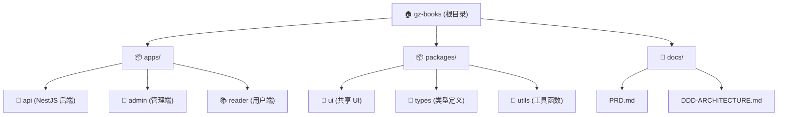

# 众慧图书借阅系统 - AI 上下文文档

**项目类型**: 纸质图书借阅管理系统 (Monorepo)
**创建时间**: 2025-11-02 12:30:16
**架构模式**: DDD + pnpm Workspace Monorepo
**当前状态**: 脚手架搭建完成，核心功能开发中

---

## 变更记录 (Changelog)

### 2025-11-02 12:30:16 - 初始化 AI 上下文
- 创建根级和模块级 CLAUDE.md 文档
- 生成 `.claude/index.json` 索引文件
- 完成项目结构扫描和覆盖率分析

---

## 一、项目愿景

### 1.1 核心定位
高斯图书借阅系统是一款面向图书馆/阅览室的**纸质图书管理平台**，提供图书管理、借阅管理、在线预览等核心功能。

**核心价值**：
- 📚 纸质图书借阅全流程数字化
- 📖 电子书文件在线预览 (PDF/EPUB)
- 🎯 双端设计：管理端 + 用户端
- ⚡ 实用主义：解决实际问题，拒绝过度设计

### 1.2 设计铁律
```yaml
实用主义原则:
  - ✅ 解决实际问题，而不是假想的威胁
  - ✅ 寻找最简方案，拒绝过度设计
  - ✅ 向后兼容是铁律
  - ❌ 拒绝微内核等"理论完美"但实际复杂的方案
  - ✅ 代码为现实服务，不是为论文服务

DDD 实用化:
  - ✅ 实体 + 仓储 + 服务三层足矣
  - ❌ 不引入领域事件、CQRS、事件溯源等复杂模式
  - ✅ 清晰的领域边界 (Bounded Context)
  - ✅ 向后兼容：API 版本化，数据库迁移版本化
```

---

## 二、架构总览

### 2.1 技术栈

```yaml
架构模式: pnpm Workspace Monorepo
包管理器: pnpm 10.20.0
Node.js: >= 20.0.0

后端技术栈:
  框架: NestJS 10.4.15
  数据库: openGauss (不兼容 PostgreSQL)，注意愈发
  ORM: Prisma 6.2.1
  认证: JWT (@nestjs/jwt + @nestjs/passport)
  文件存储: 本地 /uploads 目录
  架构: DDD 领域驱动设计
  语言: TypeScript 5.7.2

前端技术栈:
  框架: Next.js 15.1.6 (App Router)
  UI库: shadcn/ui + Tailwind CSS 3.4.17
  状态管理: Zustand 5.0.3
  表单: React Hook Form 7.54.2 + Zod 3.24.1
  请求: Axios 1.7.9 + TanStack Query 5.62.12
  PDF预览: react-pdf 9.2.1
  EPUB预览: epubjs 0.3.93 + react-reader 2.0.9
  语言: TypeScript 5.7.2
  运行时: React 19.0.0

开发工具:
  格式化: Prettier 3.4.2
  类型检查: TypeScript 5.7.2 (严格模式)
  测试框架: Jest 29.7.0 (后端配置完成，前端待添加)
```

### 2.2 Monorepo 结构

```
gz-books/
├── apps/                    # 应用层
│   ├── api/                 # NestJS 后端 (端口 3000)
│   ├── admin/               # 管理端 Next.js (端口 3001)
│   └── reader/              # 用户端 Next.js (端口 3002)
├── packages/                # 共享包
│   ├── ui/                  # 共享 UI 组件 (@repo/ui)
│   ├── types/               # 共享类型定义 (@repo/types)
│   └── utils/               # 共享工具函数 (@repo/utils)
├── docs/                    # 文档
│   ├── PRD.md               # 产品需求文档
│   └── DDD-ARCHITECTURE.md  # DDD 架构设计
├── .claude/                 # AI 上下文 (本工具生成)
└── pnpm-workspace.yaml      # Monorepo 配置
```

### 2.3 领域划分

基于 DDD 的子域划分：

```
核心子域:
  - 📚 图书领域 (Book Domain): 图书信息管理、分类管理
  - 📖 借阅领域 (Borrow Domain): 借阅全流程管理

支撑子域:
  - 👤 读者领域 (Reader Domain): 读者信息管理、借阅权限
  - 🔐 认证领域 (Auth Domain): 用户认证、授权、角色管理
  - 📁 文件领域 (File Domain): 文件上传、存储、元数据管理
```

---

## 三、模块结构图



---

## 四、模块索引

| 模块路径 | 职责描述 | 语言/框架 | 入口文件 | 文档 |
|---------|---------|----------|---------|-----|
| `apps/api` | 后端 API 服务，DDD 架构，提供 RESTful 接口 | NestJS + Prisma + openGauss | `src/main.ts` | [查看](./apps/api/CLAUDE.md) |
| `apps/admin` | 管理端应用，图书/借阅/读者管理 | Next.js 15 + shadcn/ui | `app/page.tsx` | [查看](./apps/admin/CLAUDE.md) |
| `apps/reader` | 用户端应用，图书检索与在线预览 | Next.js 15 + react-pdf/epubjs | `app/page.tsx` | [查看](./apps/reader/CLAUDE.md) |
| `packages/ui` | 共享 UI 组件库，基于 shadcn/ui | React 19 + Tailwind CSS | `index.tsx` | [查看](./packages/ui/CLAUDE.md) |
| `packages/types` | 共享 TypeScript 类型定义 | TypeScript | `index.ts` | [查看](./packages/types/CLAUDE.md) |
| `packages/utils` | 共享工具函数 (日期、格式化等) | TypeScript | `index.ts` | [查看](./packages/utils/CLAUDE.md) |

---

## 五、运行与开发

### 5.1 环境要求

```bash
Node.js: >= 20.0.0
pnpm: >= 9.0.0
数据库: openGauss 
```

### 5.2 快速启动

```bash
# 1. 安装依赖
pnpm install

# 2. 配置环境变量
cp apps/api/.env.example apps/api/.env
# 编辑 DATABASE_URL 和其他配置

# 3. 数据库迁移
cd apps/api
pnpm prisma:migrate

# 4. 启动所有应用 (并行)
pnpm dev

# 或单独启动
pnpm dev:admin   # http://localhost:3001
pnpm dev:reader  # http://localhost:3002
pnpm dev:api     # http://localhost:3000
```

### 5.3 常用命令

```bash
# 开发
pnpm dev                  # 启动所有应用
pnpm dev:admin            # 仅管理端
pnpm dev:reader           # 仅用户端
pnpm dev:api              # 仅后端

# 构建
pnpm build                # 构建所有应用
pnpm build:admin          # 仅管理端
pnpm build:reader         # 仅用户端
pnpm build:api            # 仅后端

# 代码质量
pnpm lint                 # ESLint 检查
pnpm format               # Prettier 格式化

# 清理
pnpm clean                # 清理所有构建产物

# 数据库 (在 apps/api 目录下)
pnpm prisma:generate      # 生成 Prisma Client
pnpm prisma:migrate       # 运行数据库迁移
pnpm prisma:studio        # 打开 Prisma Studio
```

---

## 六、测试策略

### 6.1 当前状态

```yaml
后端 (apps/api):
  测试框架: Jest 29.7.0 已配置
  测试类型: 单元测试 + E2E 测试 (配置完成)
  覆盖率目标: 核心领域逻辑 > 80%
  当前状态: ⚠️ 待编写测试用例

前端 (apps/admin, apps/reader):
  测试框架: ⚠️ 待配置 (建议使用 Jest + React Testing Library)
  测试类型: 组件测试 + 集成测试
  当前状态: ⚠️ 脚手架阶段，暂未配置

共享包 (packages/*):
  当前状态: ⚠️ 工具函数建议添加单元测试
```

### 6.2 测试命令 (后端)

```bash
cd apps/api

# 运行所有测试
pnpm test

# 监听模式
pnpm test:watch

# 测试覆盖率
pnpm test:cov

# E2E 测试
pnpm test:e2e

# 调试模式
pnpm test:debug
```

### 6.3 测试编写建议

```typescript
// 后端单元测试示例
// apps/api/src/modules/book/domain/entities/book.entity.spec.ts

describe('Book Entity', () => {
  it('should borrow book successfully', () => {
    const book = new Book({ availableCopies: 5 });
    book.borrow();
    expect(book.availableCopies).toBe(4);
  });

  it('should throw error when no available copies', () => {
    const book = new Book({ availableCopies: 0 });
    expect(() => book.borrow()).toThrow('图书库存不足');
  });
});
```

---

## 七、编码规范

### 7.1 TypeScript 规范

```typescript
// ✅ 严格模式启用
{
  "strict": true,
  "noImplicitAny": true,
  "strictNullChecks": true
}

// ✅ 命名规范
class BookService {}          // PascalCase (类)
const bookRepository = {};    // camelCase (变量)
type BookDto = {};            // PascalCase (类型)
enum UserRole {}              // PascalCase (枚举)

// ✅ 类型注解
function createBook(dto: CreateBookDto): Promise<Book> {
  // 明确返回类型
}

// ❌ 避免使用 any
const data: any = {};         // 禁止
const data: Book = {};        // 推荐
```

### 7.2 后端规范 (NestJS)

```typescript
// ✅ DDD 分层结构
apps/api/src/modules/book/
├── domain/              # 领域层 (纯业务逻辑)
│   ├── entities/        # 实体
│   ├── value-objects/   # 值对象
│   ├── repositories/    # 仓储接口
│   └── services/        # 领域服务
├── application/         # 应用层 (用例编排)
│   ├── use-cases/       # 业务用例
│   └── dto/             # 数据传输对象
├── infrastructure/      # 基础设施层 (技术实现)
│   └── repositories/    # 仓储实现
└── presentation/        # 表现层 (HTTP 接口)
    └── controllers/     # 控制器

// ✅ 依赖注入
@Injectable()
export class BookService {
  constructor(
    @Inject('IBookRepository')
    private readonly bookRepository: IBookRepository,
  ) {}
}

// ✅ API 路由规范
@Controller('books')        // /api/v1/books
export class BookController {
  @Get()                   // GET /api/v1/books
  @Get(':id')              // GET /api/v1/books/:id
  @Post()                  // POST /api/v1/books
  @UseGuards(JwtAuthGuard, RolesGuard)  // 认证+授权
  @Roles(UserRole.ADMIN)   // 权限控制
}
```

### 7.3 前端规范 (Next.js)

```typescript
// ✅ 目录结构 (App Router)
app/
├── (auth)/              # 路由组 (不影响 URL)
│   └── login/
├── (dashboard)/
│   ├── books/
│   └── layout.tsx       # 共享布局
├── layout.tsx           # 根布局
└── page.tsx             # 首页

// ✅ 组件命名
export default function BookCard() {}       // PascalCase (组件)
export function useBookQuery() {}           // camelCase (hooks)

// ✅ 服务端组件 vs 客户端组件
// 默认服务端组件
export default function BookList() {}

// 需要交互时添加 'use client'
'use client';
export default function BookForm() {}

// ✅ 数据获取
// 服务端
async function getBooks() {
  const res = await fetch('http://localhost:3000/api/v1/books');
  return res.json();
}

// 客户端 (使用 TanStack Query)
const { data } = useQuery({
  queryKey: ['books'],
  queryFn: () => axios.get('/api/v1/books'),
});
```

### 7.4 Monorepo 规范

```typescript
// ✅ 包导入规范
// 在 apps/* 中导入共享包
import { Button } from '@repo/ui';
import { Book, UserRole } from '@repo/types';
import { formatDate, cn } from '@repo/utils';

// ✅ 包依赖声明 (package.json)
{
  "dependencies": {
    "@repo/ui": "workspace:*",      // 使用 workspace 协议
    "@repo/types": "workspace:*",
    "@repo/utils": "workspace:*"
  }
}

// ✅ 包导出规范 (packages/*/package.json)
{
  "main": "./index.ts",             // 入口文件
  "types": "./index.ts",            // 类型入口
  "exports": {
    ".": "./index.ts",              // 默认导出
    "./components/*": "./components/*.tsx"  // 子路径导出
  }
}
```

### 7.5 Git 规范

```bash
# ✅ Commit Message 格式
feat: 添加图书创建功能
fix: 修复借阅记录查询 bug
docs: 更新 API 文档
refactor: 重构认证模块
test: 添加图书实体单元测试
chore: 更新依赖版本

# ✅ 分支命名
feature/book-management      # 新功能
fix/borrow-query-bug         # Bug 修复
refactor/auth-module         # 重构
docs/update-readme           # 文档
```

---

## 八、AI 使用指引

### 8.1 询问代码生成

```plaintext
示例提示词:

1. 创建新功能
"帮我在 apps/api 中创建图书分类管理模块，遵循 DDD 架构，包括：
 - Category 实体
 - CategoryRepository 接口和实现
 - CreateCategoryUseCase
 - CategoryController (CRUD 接口)"

2. 修复 Bug
"借阅记录查询时，逾期状态未正确计算。请检查 BorrowRecord 实体的
 checkAndUpdateOverdueStatus() 方法，并提供修复方案。"

3. 添加测试
"为 Book 实体的 borrow() 和 returnBook() 方法编写单元测试，
 包括正常场景和异常场景。"

4. 性能优化
"图书列表查询较慢，请分析 BookRepository.findAll() 方法，
 并提供优化方案 (分页、索引、查询优化等)。"
```

### 8.2 询问架构设计

```plaintext
示例提示词:

1. 设计新模块
"我需要添加图书评论功能，请按照 DDD 架构设计：
 - 领域模型 (实体、值对象)
 - 仓储接口
 - 业务用例
 - API 接口
 要求：评论可被管理员审核，用户可查看已审核评论。"

2. 数据库设计
"请为图书推荐系统设计数据表，需要记录：
 - 用户借阅历史
 - 图书相似度
 - 推荐算法 (协同过滤)
 要求：遵循向后兼容原则，提供 Prisma Schema。"

3. 前端组件设计
"请设计一个 PDF 阅读器组件，需要支持：
 - 分页浏览
 - 缩放
 - 全屏模式
 - 阅读进度保存
 要求：使用 react-pdf，响应式设计。"
```

### 8.3 询问问题排查

```plaintext
示例提示词:

1. 报错分析
"运行 pnpm dev:api 时报错：
 Error: P1001: Can't reach database server
 请帮我排查数据库连接问题。"

2. 类型错误
"TypeScript 报错：
 Type 'Book' is not assignable to type 'BookDto'
 在 BookController.create() 方法中，请分析原因并修复。"

3. 运行时错误
"调用 POST /api/v1/books 时返回 500 错误，
 请帮我分析 apps/api/src/modules/book/application/use-cases/create-book.use-case.ts
 可能的问题。"
```

### 8.4 上下文参考

```plaintext
AI 可自动参考的上下文:
- 本文档 (CLAUDE.md) - 项目整体架构
- 各模块 CLAUDE.md - 模块详细说明
- docs/PRD.md - 产品需求
- docs/DDD-ARCHITECTURE.md - DDD 设计细节
- .claude/index.json - 文件索引

提问时可显式指定:
"请参考 docs/DDD-ARCHITECTURE.md 中的借阅领域设计，
 帮我实现续借功能。"
```

### 8.5 AI 辅助工作流

```plaintext
推荐工作流:

1. 开发新功能
   AI 生成代码 → 本地测试 → 代码审查 → 集成

2. 重构代码
   描述目标 → AI 分析方案 → 逐步重构 → 测试验证

3. 学习代码
   "请解释 BorrowDomainService 的作用和实现原理"
   AI 提供分析 → 理解架构 → 实践修改

4. 代码审查
   "请审查这段代码，检查：安全性、性能、可维护性"
   AI 提供建议 → 优化改进
```

---

## 九、常见问题 (FAQ)

### 9.1 开发环境


**Q: pnpm dev 启动失败怎么办？**
```bash
# 1. 检查 Node.js 版本
node -v  # 应 >= 20.0.0

# 2. 清理依赖重装
rm -rf node_modules apps/*/node_modules packages/*/node_modules
pnpm install

# 3. 检查端口占用
lsof -i :3000  # API
lsof -i :3001  # Admin
lsof -i :3002  # Reader
```

**Q: Prisma 迁移失败？**
```bash
# 1. 检查数据库连接
cd apps/api
pnpm prisma db pull  # 测试连接

# 2. 重置数据库 (开发环境)
pnpm prisma migrate reset

# 3. 重新迁移
pnpm prisma migrate dev
```

### 9.2 开发规范

**Q: 如何添加新的共享组件到 @repo/ui？**
```bash
# 1. 在 packages/ui/components 下创建组件
# 2. 导出组件到 packages/ui/index.tsx
export { NewComponent } from './components/new-component';

# 3. 在应用中使用
import { NewComponent } from '@repo/ui';
```

**Q: 如何在后端添加新的领域模块？**
```typescript
// 1. 创建目录结构
apps/api/src/modules/new-module/
├── domain/
├── application/
├── infrastructure/
├── presentation/
└── new-module.module.ts

// 2. 在 app.module.ts 中导入
@Module({
  imports: [NewModuleModule],
})
export class AppModule {}
```

### 9.3 部署相关

**Q: 如何构建生产版本？**
```bash
# 构建所有应用
pnpm build

# 产物位置
apps/api/dist/          # 后端
apps/admin/.next/       # 管理端
apps/reader/.next/      # 用户端
```

**Q: 生产环境文件上传路径？**
```bash
# 开发环境: apps/api/uploads
# 生产环境: 配置到持久卷或对象存储

# 环境变量配置 (apps/api/.env)
UPLOAD_PATH=/data/uploads       # 本地路径
# 或
S3_BUCKET=my-bucket             # 对象存储 (未来扩展)
```

---

## 十、相关链接

- [产品需求文档 (PRD)](./docs/PRD.md)
- [DDD 架构设计](./docs/DDD-ARCHITECTURE.md)
- [Prisma Schema](./apps/api/prisma/schema.prisma)
- [NestJS 官方文档](https://docs.nestjs.com/)
- [Next.js 15 文档](https://nextjs.org/docs)
- [shadcn/ui 组件库](https://ui.shadcn.com/)

---

**文档维护**: 本文档由 AI 自动生成和维护，建议每次架构调整后重新运行初始化工具。
